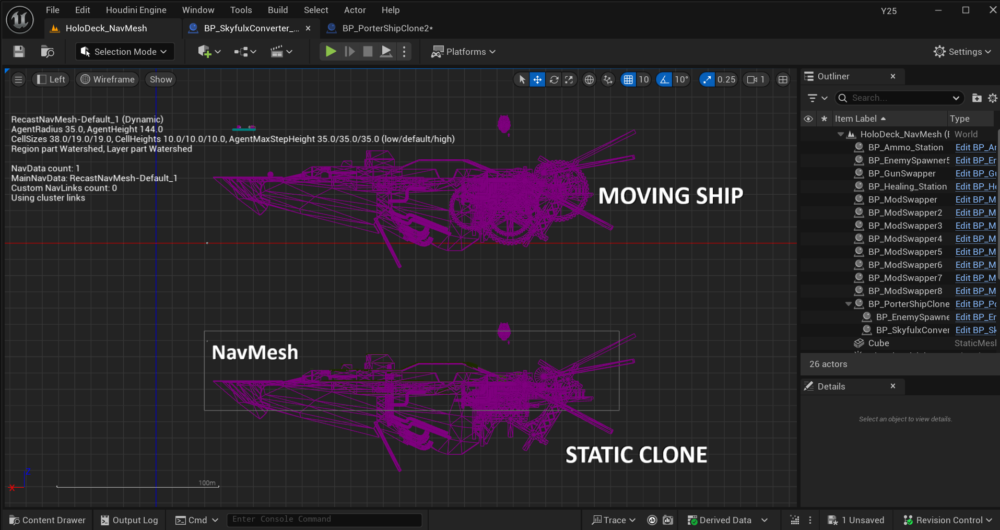
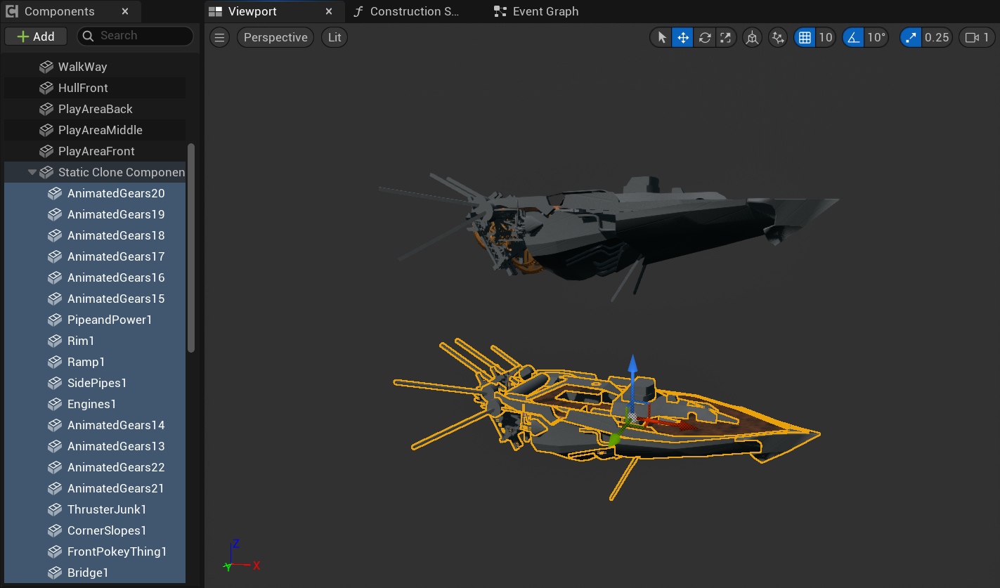

# Solving Navigation Mesh Movement in Unreal Engine 5: A *Skyguard* Development Case Study

One of the most fascinating challenges during the development of *Skyguard* was enabling the movement of ships. As the name suggests, *Skyguard* takes place in the skies. In this retrofuturistic steampunk world, you play as a mercenary tasked with protecting a fleet of airborne ships traveling between floating cities. To make the experience more immersive, our director insisted that the ships themselves should move.

At first, we considered simply animating the clouds to give the illusion of motion. But this wasn’t enough—without moving the ships themselves, they would appear static relative to each other and the environment, breaking immersion. So, the decision was made: the ships would move.

At first glance, moving the ships seems like it should be straightforward. But in *Skyguard*, which is a horde-based game, we expect multiple AI agents to move along with the ships. Here lies the real challenge. In Unreal Engine 5, AI agents require a structure called a **Navigation Mesh** (*NavMesh*) to move intelligently through the world. This structure stores vast amounts of pathfinding data and spatial awareness information, and by design, it's meant to remain static.

Forcing the NavMesh to move with the ships dramatically impacted performance—it takes about **1.2 seconds to regenerate** a navigation mesh, which is far too long for a real-time game. This made the game unplayable whenever ships moved.

I was assigned the intimidating task of reconciling AI navigation with moving ships. Naturally, I turned to online research, but to my surprise, solutions were scarce. There was no comprehensive, publicly available answer. I did find some experimental references to duplicating environments and AI agents—using offscreen static versions to provide navigation data for moving counterparts.

Inspired by this idea, I initially wrote a custom actor class that mimicked the movements of ships and AI agents using duplicated actors. Each ship or AI agent had a pair: a static, invisible version and a moving one. This setup worked in principle, but the performance cost of maintaining two actors per unit added up quickly at scale. Even though the proxy versions were invisible, the overhead was too high.

After extensive trial and error, I found a better solution by reworking Unreal Engine 5’s default component system to support a **proxy component**. I created a custom component class responsible for maintaining a reference to the root component and overriding specific behaviors to decouple its movement from the root’s.

This architecture allowed for a single actor per agent or ship. Each actor contained:

- A **static root component** that remained in place and provided navigation data,  
- A **minimal mesh component** representing the walkable space or NPC body,  
- A **“clone” scene component** containing all visible meshes, effects, and textures.

To simplify synchronization, I developed an **offset helper class** that could be attached to any clone component. When the root-to-clone offset was updated in a ship, the change propagated to all agents aboard that ship automatically. This setup proved both performant and scalable, supporting seamless ship movement and AI navigation.

Behind the scenes, all action was happening offscreen: invisible ships held static NavMesh data while invisible AI agents interacted with the world—reacting to player movement, taking damage, and responding to environmental stimuli. Meanwhile, on the player's screen, a fleet of majestic flying ships traveled between floating cities, or plunged dramatically from the skies if left unprotected.

This solution required a deep understanding of Unreal Engine 5’s component system—but more importantly, it demanded a creative approach to technical problem-solving. It meant using the tools Epic Games provides in ways the original designers may not have anticipated. It stands as proof that **thinking outside the box truly pays off**.

I’ll admit, the idea of rewriting UE5's backend systems was daunting—something that only comes with years of engine development experience. But by relying on the tools I had and applying a little ingenuity, I was able to find an elegant and effective solution.

---

**For a complete breakdown of this solution, please refer to the following guide:**  
📄 <a href="https://docs.google.com/document/d/1l8oU8zkWRV1odTLHMh3s8Eom5v8WSegUEd11rBnor60/edit?tab=t.0#heading=h.oivyhk9akomf" target="_blank" rel="noopener noreferrer">*Custom Navigation System Guide*</a>
