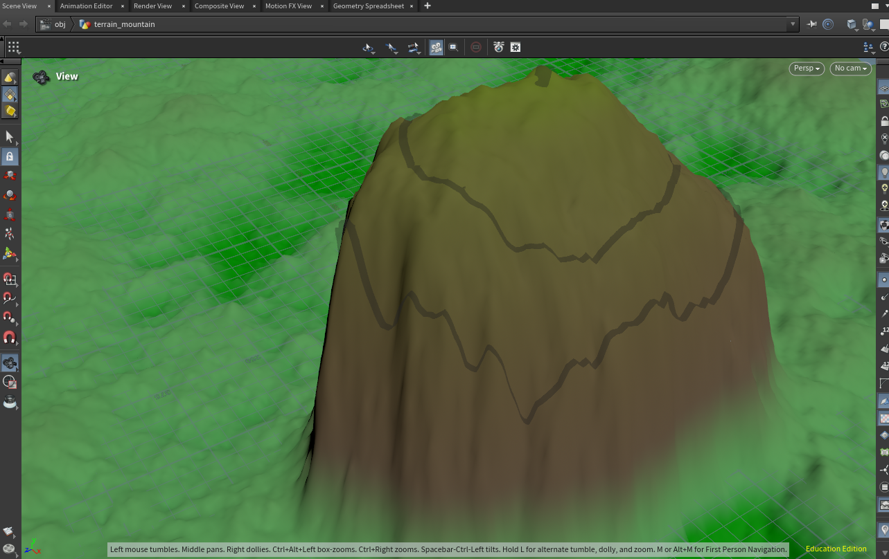
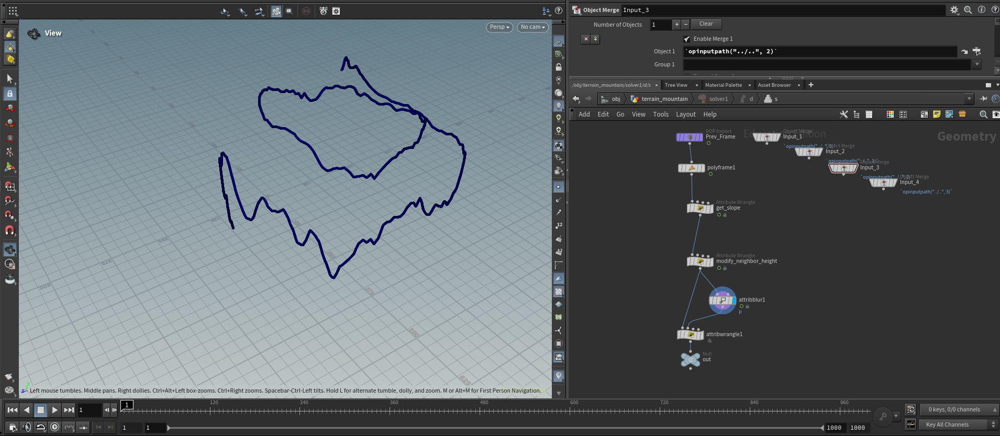
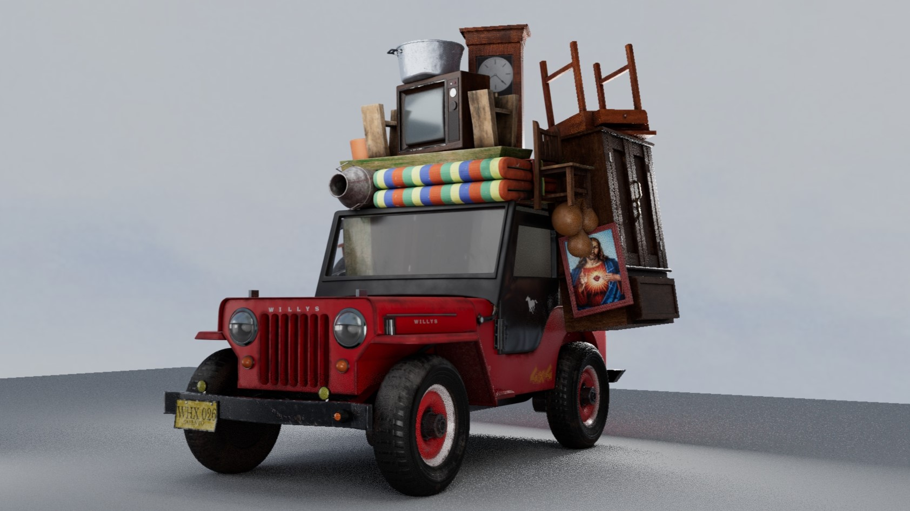
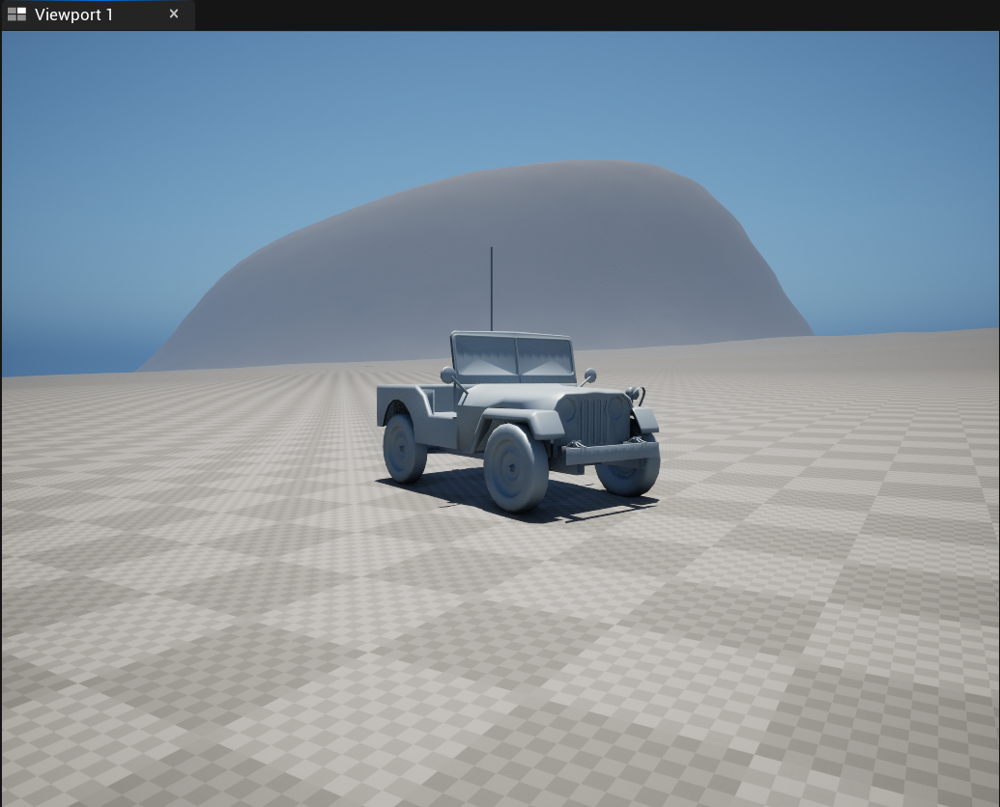
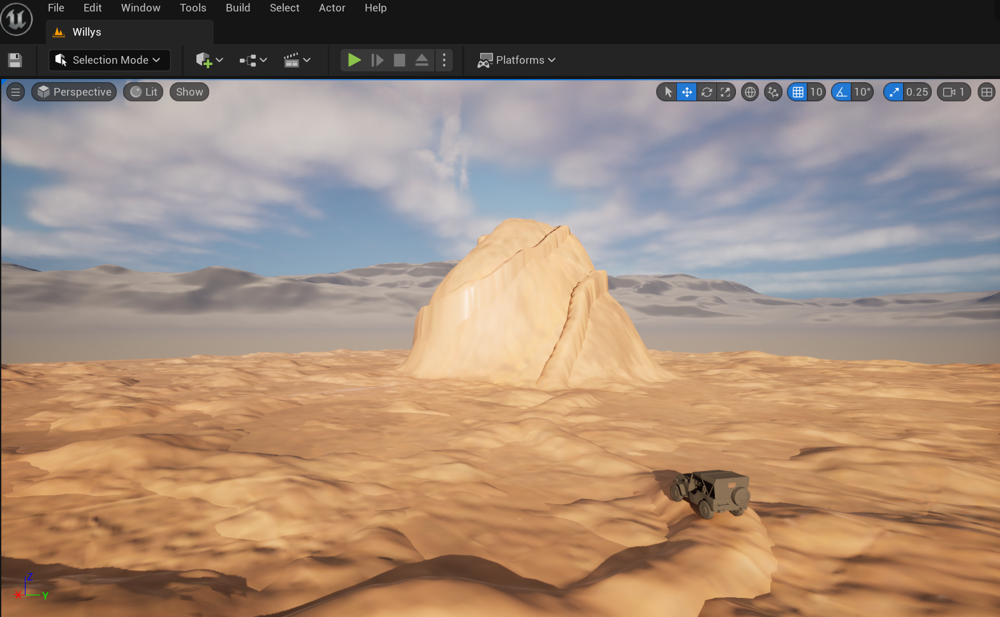

## *Moving Up: A Solo Ongoing Development Experience*

While in college, I decided to build a game from the ground up—mainly to gain hands-on experience in every stage of the development process, including prototyping, asset creation, level design, and gameplay programming.

For inspiration, I looked to my home country’s culture. In Colombia’s southwestern region, known as *El Eje Cafetero*, there’s a fantastic tradition centered around Jeep Willys—vintage military vehicles affectionately referred to simply as “Willys.” These cars are still used today as primary cargo transport, carrying everything from sacks of coffee beans to heavy equipment, household furniture, and even people.

I knew right away that Willys would be the perfect theme for a game. All I needed was a game mechanic to tie it all together. As I continued digging into the region’s culture, I remembered a magical place called *El Peñón*—a massive 656-foot rock formation with a human-made staircase that leads all the way to the top. This landmark is the heart of Guatapé, a beautiful town surrounded by lakes and mountains. The concept of climbing this imposing rock felt like a perfect complement to the Willys theme, and I decided to combine both ideas into one game.

In *Moving Up*, you control a Willys truck with a simple mission: complete a move-out to the top of *El Peñón*. The catch? You’ve run out of rope, so none of the furniture in your truck is tied down. You'll have to rely on your driving skills to keep everything in place while navigating the wiggly, narrow, and intimidating terrain.

With the concept in place, I moved on to prototyping. To start, I needed two core elements: *El Peñón* as the level and a Willys as the main character. While working on the level, I realized it would be inefficient to rebuild terrain by hand for each iteration. So, I turned to SideFX Houdini. I learned how to generate terrain using height maps and create a dynamic mesh that could adapt to varying elevations automatically. This mesh could take in parameters like slope angle, width, and height. I exported both the mesh and the height map into Unreal Engine and used them to shape the game’s level. This workflow significantly streamlined the level design process and gave me the flexibility to implement my own ideas using parameter inputs.

Designing the Willys took a more manual approach. I spent a lot of time researching how Willys trucks look in the *Eje Cafetero* region. I compiled reference images into a slide deck to study their colors, textures, materials, and how cargo is typically stacked. Using Autodesk Maya, I modeled the car with close attention to triangle count. Once the model was complete, I UV-mapped it and brought the maps into Adobe Substance Painter, where I procedurally textured every element with a focus on detail and authenticity.

Alongside the art pipeline, I also worked on gameplay programming. After researching different vehicle systems, I decided to use Unreal’s Chaos Vehicles system as the game’s foundation. I created a basic rig for my Willys model and tuned values like center of gravity, suspension, and torque. I set up the controllers and the game mode and began test-driving it on my Houdini-generated levels. It took several iterations and a good deal of refactoring before the car and the environment felt like they truly belonged together.

Fortunately, I had the opportunity to present my project in my animation class. The feedback I received each time was incredibly helpful in refining the feel of the game.

Since this is one of my personal projects, I’m striving to complete something that’s polished—both visually and mechanically. I’m still actively working on *Moving Up*, and I’d love to hear your thoughts or ideas based on the little gameplay you’ve seen so far. Feel free to use the contact tab to reach out—I’d deeply appreciate it.

Stay tuned for the final version (hopefully coming soon)!

**Thanks!**
