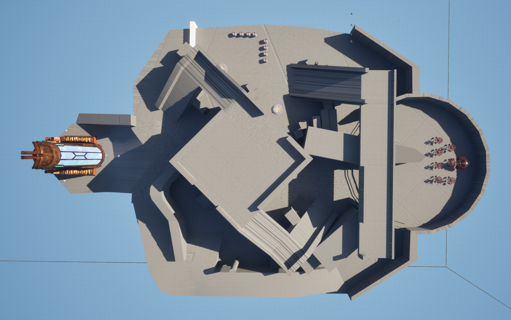

---
layout: post
title: Level Design for Skyguard
date: 2025-06-16 17:56 -0600
---

## Level Design in *Skyguard*

An early concern during *Skyguard*'s pre-production was the level design. This would define a key component of the game: the space shared by players and NPCs. It needed to feel organic within the world while also supporting gameplay mechanics and systems.

*Skyguard* was conceived as a horde-based shooting game with parkour and platforming elements. You play as a mercenary commissioned to guard a fleet of flying ships, protecting them from robot pirates intent on sabotaging the vessels to steal their materials. In addition to narrative and gameplay considerations, level design was also shaped by a major limiting factor—our team size. Initially, our team consisted of just five programmers and designers, so we had to keep our levels modest in scale.

I took on the responsibility of designing early-level concepts to present to the team. This process involved sketching scenarios and routes on paper, modeling them in Autodesk Maya, scaling them to standard dimensions, exporting them into Unreal Engine 5, and building basic test levels with generic players and NPCs.

Before discovering what worked and what made the game loop fun, I started with very simple layouts—so generic they almost felt purposeless. But they served their purpose: rapid iteration. Through quick testing and minor edits, we were able to explore new movement possibilities and experiment with different mechanics.

Iteration became essential. It helped us identify and define the design pillars that would guide our level development. Initially, we prioritized ensuring players could always see incoming enemies. As a horde game, player awareness was crucial, so we opted for open and linear spaces. This worked to an extent—enemies moved from point A to point B, and players had a clear line of sight to intercept them.

However, repeated playtesting revealed a flaw in this approach: it was too repetitive. Since *Skyguard* was meant to be a short, replayable experience, we needed levels that encouraged variety and exploration. Designing around a single optimal route limited that goal. So, we chose to sacrifice constant visibility and strict linearity.

By breaking away from those early constraints, we discovered a new set of design pillars—ones that better served our platforming vision and the snappy movement we wanted to emphasize:

- **Verticality**  
- **The ability for players to reach any point of the ship within 5 seconds**  
- **Alternative routes for both players and NPCs**  
- **Paths accessible only by players using their movement abilities**  
- **A mix of open and closed spaces**  
- **Cover and vantage points**

My goal was to create a level that provided a fresh experience with each playthrough, and even with each wave of enemies. To achieve this, I looked at video and image references from various shooter and platformer games—and played a few for inspiration. Titles like *Valorant*, *Ratchet & Clank*, and *Overwatch* were especially insightful.

From this research, I learned that dome-like, circular spaces are ideal for maintaining flow and cyclical gameplay. These layouts allow for multiple paths, dynamic movement, and opportunities to use parkour mechanics in fun, meaningful ways.

After many iterations, I presented the following scenario:

> *As seen, this level offers multiple distinct yet cohesive playable areas.*  
> There’s an open circular hallway that serves as an arena for high-intensity combat, and a sheltered lower level beneath the main dome for cover or defensive play. Two separate paths lead to a vantage point at the top of the map. Crawl spaces, multiple NPC routes, and platforming elements give players freedom of movement and encourage varied strategies.

> *We can see the distinct paths that NPCs can take to get to the same level*

This scenario successfully integrates the pillars that make *Skyguard* fun and replayable. It showcases the thought and effort our team put into player movement and enemy interaction. Designing this level—and solving the challenge of embedding it into the game’s core—taught me a valuable lesson: levels aren’t just stages where the game takes place. They’re a design tool in their own right—capable of communicating ideas, reinforcing mechanics, and creating unforgettable experiences. Shape, verticality, exploration, layout, and spatial design can all be wielded thoughtfully to elevate gameplay in powerful ways.

Here’s a brief view of the level being playtested. 

<iframe width="560" height="315" src="https://www.youtube.com/embed/avKQziwWKsE" 
frameborder="0" allowfullscreen></iframe>

