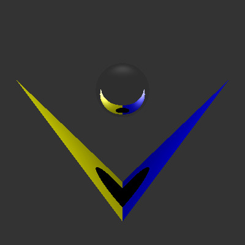
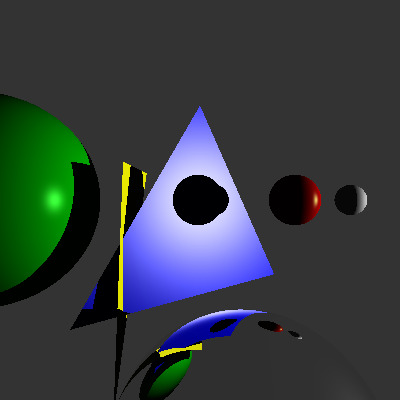
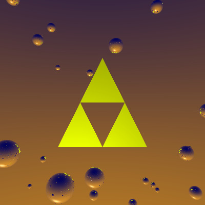

## Building a Ray Tracer from Scratch

The development of computer graphics was as transformative as the invention of the computer itself. With the introduction of cathode-ray tubes, computers became more accessible, providing users with an interface and a more human language to interact with the machine. Since then, computer graphics have evolved rapidly—and they continue to do so. These are just a few of the reasons why I find computer graphics such an exciting and meaningful field.

While trying to better understand the fundamentals behind modern 3D imagery creation software—like Substance, Maya, or Blender—I decided to code a simple ray tracer from the ground up, without using any APIs. To do this, I conducted extensive research on image file formats, virtual cameras, color gamuts, ray casting, lighting models, and vector mathematics.

After studying some of the principles behind rudimentary computer graphics systems like OpenGL, I initially considered using C for its low-level capabilities and fast processing. However, since building a single scene required many interacting components—such as lights, models, traces, and materials, each with their own attributes and variables—I decided that C++ would be a better fit. Its object-oriented features, including inheritance and operator overloading, allowed for more elegant and modular design.

I began by figuring out how to produce a simple image file that would be easy to render universally. For simplicity, I chose to generate `.ppm` images, a format that stores pixel data as human-readable text. This made it easy to populate arrays with pixel values and render the output.

Once I successfully produced a basic image with arbitrary colors, I moved on to object creation. Following OpenGL conventions, I used a vector structure to define points in 3D space—these would serve as the surfaces that interrupted the background color. To keep things manageable, I limited the objects to spheres and triangles. I also created a `Material` class to give each object its own color properties and attributes.

Next came one of the most complex—and fun—parts of the project: lighting. In basic computer graphics, we typically work with three lighting models: ambient, diffuse, and specular. Each of these has its own formula to simulate how light interacts with surfaces. By implementing these models and assigning unique coefficients to different materials, I was able to give each object more personality and realism. The lighting logic was incorporated into the `Material` class.

Finally, it was time to cast rays recursively. By feeding a function with an origin and destination point, I could recursively calculate the direction of the ray against the object’s surface normals. Using the dot product, I determined how to shade each pixel. Taking advantage of recursion, I also added a metallic property to the `Material` class to simulate reflections based on a reflection coefficient.

By the end of the project, I had built a fully functional ray tracer in C++. It could take in object coordinates, assign them a material with ambient, diffuse, specular, and reflection coefficients—as well as colors—and produce `.ppm` image outputs to create unique scenes.

This project was an incredibly enlightening experience. By building a ray tracer from scratch, I gained a much deeper understanding of the core principles that power modern 3D graphics tools. It gave me a newfound appreciation for how complex and elegant computer graphics truly are. Just like the invention of the computer transformed human interaction with machines, learning to create visual representations from code transformed how I see the intersection of technology and creativity.

Feel free to contact me to take a look a the source code!

Below is a sample of some of the images I generated:

