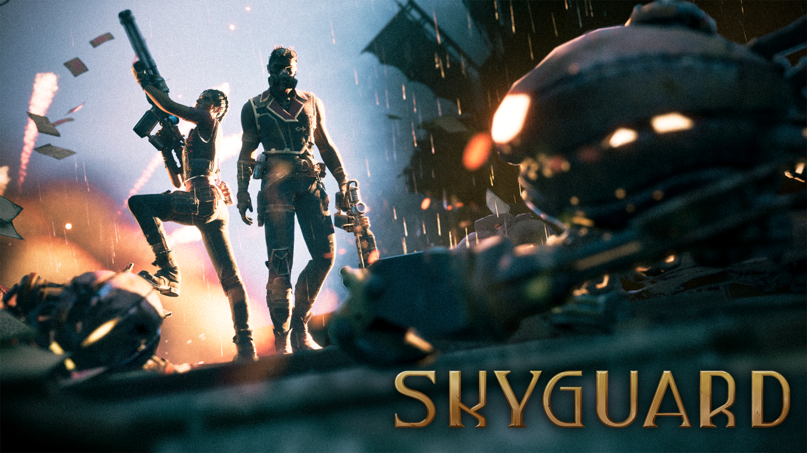

## SKYGUARD is Out on Steam!

Today is a special day—**SKYGUARD** has finally been released on Steam!

Over the past year (and a couple of months), I had the incredible opportunity to work on this amazing project, which also serves as the **2025 Capstone Project for the BYU Center for Animation**. The development of SKYGUARD was a collaborative effort involving around 20 talented and brilliant individuals who contributed both artistic and technical skills to bring this vision to life.

This experience taught me invaluable lessons—not just in game design and programming, but in teamwork and personal growth. I had the privilege of serving as a gameplay programmer and AI behavior lead. The success of this role was made possible thanks to the close collaboration with our producer, who not only acted as a vital bridge between the creative direction and the programming team but also took on programming tasks herself.

In this role, I designed, prototyped, and implemented distinct enemy types to enhance the player experience. I also contributed to core gameplay systems, including movement for both players and enemies, as well as gameplay abilities.

Working on a small team, SKYGUARD's development came with challenges that often felt larger than me. But time and time again, honest effort, open communication, and shared vision carried us through. Feedback from the director and professors, together with thje process of iterating through different solutions quickly made me a better programmer and a humbler person. 

I’m deeply grateful to the faculty of the BYU Center for Animation and to every teammate who helped make this “impossible game” possible. You guys are awesome.

I could keep talking about how special this production was, but it’ll be easier to understand if you just play it yourself: [**Join the SKYGUARD.**](https://store.steampowered.com/app/3173250/SKYGUARD/)

---

Working on SKYGUARD was a powerful reminder of why I love creating games. It brought together the art of storytelling, the science of technology, and the magic of collaboration. Watching a project grow from a simple prototype to a full release on Steam—alongside such a passionate and skilled team—was one of the most rewarding experiences of my academic and creative journey.

Stay tuned for more posts on my particular contributions to SKYGUARD.
