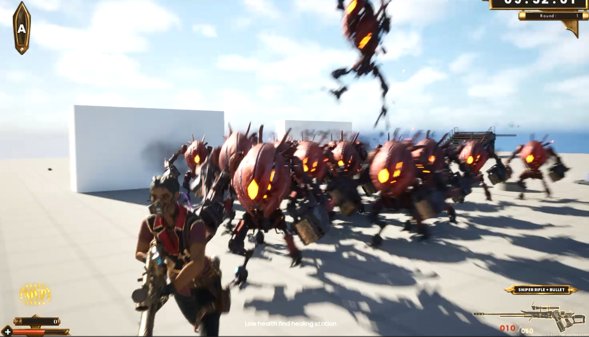

## Coordinating the Grunt Gap Closer Attack — A Simple Solution

An interesting challenge that emerged during enemy behavior development was related to the **Grunt's gap closer attack**—an ability that allowed Grunt enemies to perform a long jump toward the player to get into melee range. This mechanic made Grunts more dynamic and threatening, but it came with an issue: **multiple enemies could trigger the attack simultaneously**.

While this wasn’t a problem in small groups, larger hordes could result in several Grunts jumping and attacking the player at once—leading to an unfair instant K.O.

As AI Lead, I decided that the best solution was to **coordinate the Grunts' gap closer attacks**, ensuring that only one Grunt could perform it at a time, based on proximity to the player. I explored several approaches—some more elaborate than others—but initially settled on a straightforward C++ solution.

I added logic directly to the `GapClose` task: get a reference to the level world, retrieve all Grunt actors, and iterate through them to check if any were already performing the attack.

While this worked, it wasn’t scalable. As the size of the horde increased, the cost of iterating through every Grunt and accessing the world became noticeable. Stress testing revealed a slight performance drop during these gap closer events. I needed a better, **simpler** solution.

And then it hit me: *keep it simple*. All I needed was a **shared flag**—a primitive object containing a single boolean that every Grunt could access. This would be referenced by a **Behavior Tree Decorator** at negligible computational cost.

The solution took **less than 15 lines of code**:

```cpp
#include "GapCloserCoordinator.h"

bool UGapCloserCoordinator::IsGapCloserActive()
{
    return bIsActive;
}

void UGapCloserCoordinator::SetGapCloser(const bool bActive)
{
    bIsActive = bActive;
}

bool UGapCloserCoordinator::bIsActive = false;
```


>*Grunt Performing a Gap Closer Attack*

This experience reminded me of the value of following core programming principles. Simplicity, clarity, and shared state management—as basic as they might seem—can be powerful tools in game development and software engineering alike.

<div style="text-align: center;">
  <iframe width="560" height="315" src="https://www.youtube.com/embed/4HRGCR6WMg4" 
  frameborder="0" allowfullscreen></iframe>
</div>
> *Gap Closer Attack Demo.* 
