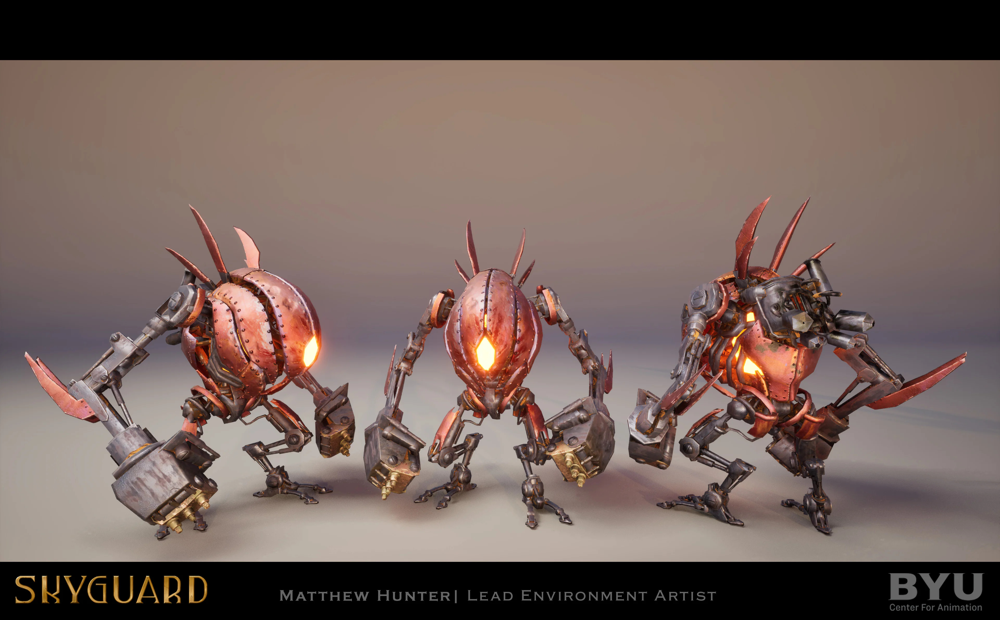
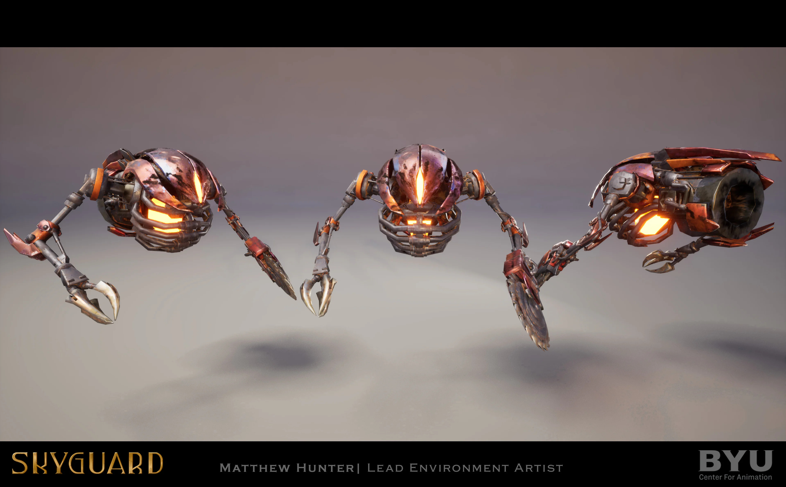
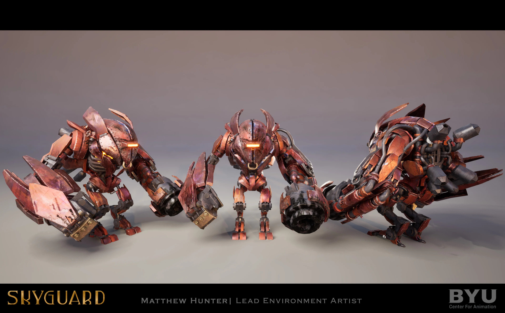

## Working as AI Lead on *SKYGUARD*

Although my official role as NPC behavior lead came later in production, I began designing and prototyping enemies from the very beginning of the pre-production phase. Working closely with the producer and director, I pitched many early concepts for what our enemy robots could look like and how they would function individually.

*SKYGUARD* was designed as a horde-based third-person shooter, where **mobility was just as important as shooting**. Much of that mobility was initially emphasized through level design (you can find a breakdown of that process in [this post](../level-design-for-skyguard)), but we quickly realized that layout alone wasn’t enough—you also need to *encourage* the player to keep moving and *discourage* them from camping in one spot. That’s when we understood: the dynamism of player movement would depend heavily on **enemy behavior**.

Because of their central role in the gameplay loop, it was clear that enemies in *SKYGUARD* required thoughtful design. To add depth and variety, we chose to implement multiple enemy types—each with a distinct role, behavior, and personality—while keeping them visually and thematically cohesive.

Early on, I developed a demo featuring three core enemy types:

- **Grunt**: a basic unit that locates and attacks the ship’s engine. When attacked, it rushes to the objective in an attempt to complete its task before being destroyed.
- **Tank**: a large, heavily armored unit that acts like a shield. It absorbs damage, blocks player access to grunts, and charges at the player if they get too close.
- **Kamikaze**: my personal favorite—a small, high-speed unit that charges at the player to initiate a self-destruct sequence, generating an impulse blast that can launch the player into the air.

  <iframe width="560" height="315" src="https://www.youtube.com/embed/Pi3gq5fOyHM" 
  frameborder="0" allowfullscreen></iframe>

> *Early enemy prorotype.* 

This initial proposal was well received. Each enemy had a clear role, distinct behavior, and used simple visual cues like size and speed to communicate its function. But we needed to go further—not just focusing on enemies individually, but on how they functioned *as a horde*.

At this point, we began a feedback loop: I would tweak and update enemies, prototype new ideas, and present them to the team. Based on the feedback, I refined the designs and repeated the process.

Together with our producer—who was closely involved in enemy design—we decided to keep the grunt and tank enemies, with some behavioral changes, and rework the kamikaze into a flying unit. These new flying bots would charge at players from the air, dealing melee damage and exploding upon death. With low health and high speed, they were easier to spot within a crowd and added vertical variation to the ground-heavy combat.

With the core concepts in place, I moved into full production. I was responsible for constructing and polishing enemy behavior trees, writing custom tasks and decorators in C++, and presenting updates to the director for approval.

Even in this stage, enemy behavior continued to evolve. Each enemy started as a simple abstraction, which we refined through iteration. For example, we made grunts more reactive—attacking nearby players or responding as a group when one was targeted. They were also given a gap-closing jump attack to increase pressure on the player. *(You can read more about that challenge in [this post](../skyguard-a-simple-solution-to-a-complex-problem)).*

> *Enemy renders by Matthew Hunter.* 

The tank also evolved significantly from its original role as a passive shield. After reviewing the 3D model, I realized it had more of a boss-like presence. I redesigned its behavior to reflect that, splitting it into two stages: **Normal** and **Frenzy**. In Normal mode, the tank shields, dodges, charges, and shoots. In Frenzy mode—triggered when its health drops below a certain threshold—it becomes erratic and deals increased damage. These changes made the tank the most challenging and memorable enemy in the game.

Though I led the enemy design and programming, I collaborated closely with our design team by **parameterizing enemy values** like movement speed, charge speed, jump distance, perception radius, frenzy activation threshold, knockback force, and more. Designers could then tweak these directly in Blueprints without needing to dive into the underlying code. This greatly sped up iteration and refinement.

Toward the end of production, I focused on debugging, optimizing, and refining the enemy systems based on playtest feedback.

  <iframe width="560" height="315" src="https://www.youtube.com/embed/r4F3kfUve5k" 
  frameborder="0" allowfullscreen></iframe>

> *Final enemy demo.* 

---

Each enemy type in *SKYGUARD* was designed to serve a unique purpose while reinforcing the game’s emphasis on player movement. Much of *SKYGUARD*’s personality comes not only from its beautiful art direction, but from the intelligence and dynamics of its enemies—both individually and as a group. I’m incredibly proud of the work I did leading AI development, and equally grateful to the brilliant teammates who gave feedback, challenged my ideas, and helped bring these enemies to life.

I believe the enemies in *SKYGUARD* are fun, dynamic, and worth fighting again and again—and that’s only possible because of the incredible work done by the entire development team.
